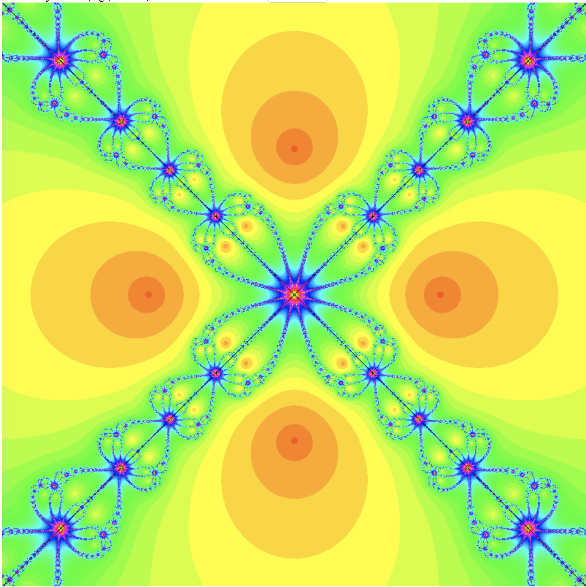

# newton-fractal
Basic code for a web page that generates fractals generated from Newton's method for finding polynomial roots. All code was written by ChapGPT-4o. 

It has been known since at least 1983 that the Newton-Raphson method for finding roots of a polynomial is a good way to generate fractals. Contrary to what we might naively expect, Newton-Raphson does not alwaays converge to the root closest to the starting point. The result is beautiful fractals that are stylistically simpler than the more famous Mandelbrot Set.

A classic example is the roots of $z^4-1$.

